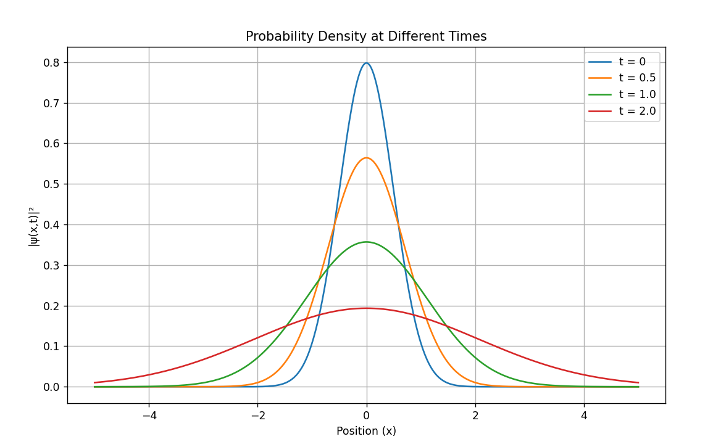
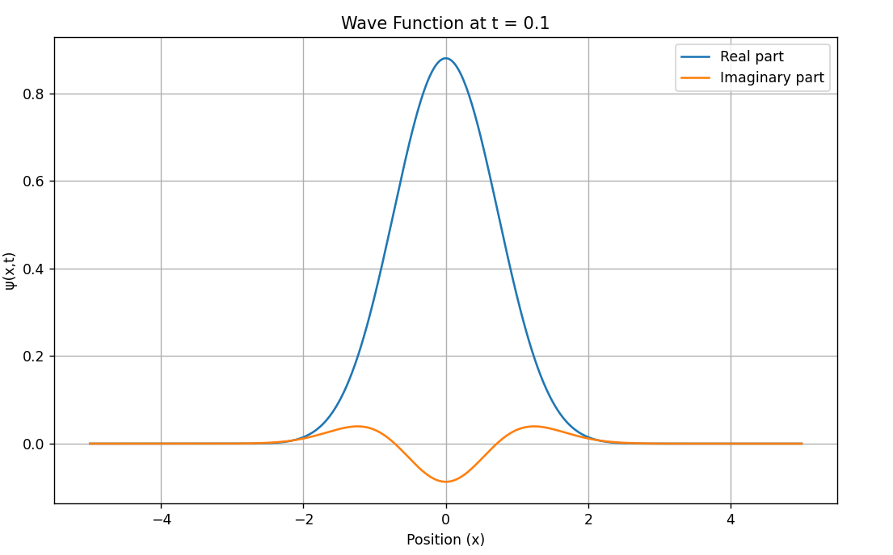

# Wave Function Simulation – Gaussian Packet in 1D

Welcome!  
This project simulates the time evolution of a **Gaussian wave packet** — a foundational concept in quantum mechanics that shows how a free particle's wave function behaves over time.

---

## What's this all about?

In quantum physics, the wave function ψ(x, t) tells us the probability of finding a particle at a certain position `x` and time `t`. A Gaussian wave packet is like a "quantum blob" that starts out localized and then spreads as time passes.

This simulation helps you **visualize**:

- The **real and imaginary parts** of the wave function.
- The **probability density** |ψ(x, t)|² and how it evolves.

It’s a great way to understand wave mechanics with just a bit of math and Python.

---

##  What does the simulation show?

- A static plot of the wave function at a specific time.
- Animated spreading of the wave packet through multiple time steps.
- Clearly separated **real**, **imaginary**, and **probability** components.

---

##  Tech Stack

- **Python 3**
- **NumPy** – for efficient numerical computations.
- **Matplotlib** – for plotting wave visuals.

---

##  How to Run

1. Clone this repo:
   ```bash
   git clone https://github.com/Bassant0/wave-function-simulation.git
   cd wave-function-simulation
2. Install the required libraries (if not already installed):
    ```bash
   pip install numpy matplotlib

3. Run the simulation:
    ```bash
    python gaussianwavefunction.py
## The Formula
The wave function is calculated using:

    ```

    ψ(x, t) = (2a/π)^1/4 × 1 / sqrt(1 + (2iħt)/m) × exp[-a x² / (1 + (2iħt)/m)]
    Where:

    a: controls the initial width (spread) of the wave packet

    m: mass of the particle

    ħ: reduced Planck’s constant (set to 1 for simplicity)
## Sample Output: 


Author
Bassant Ahmed Salama
2025


